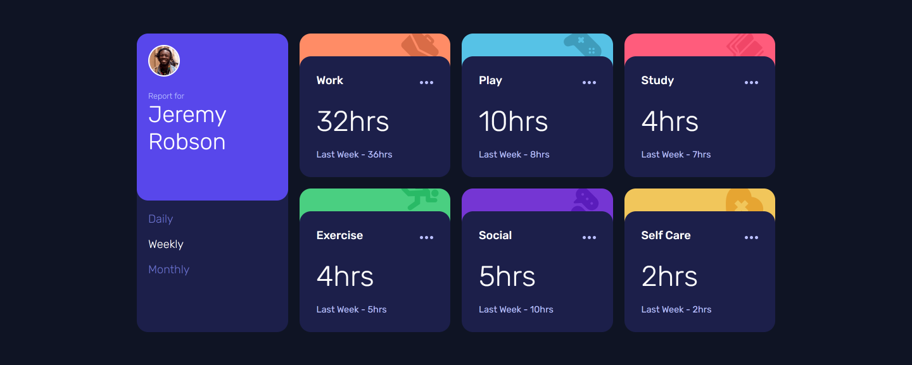
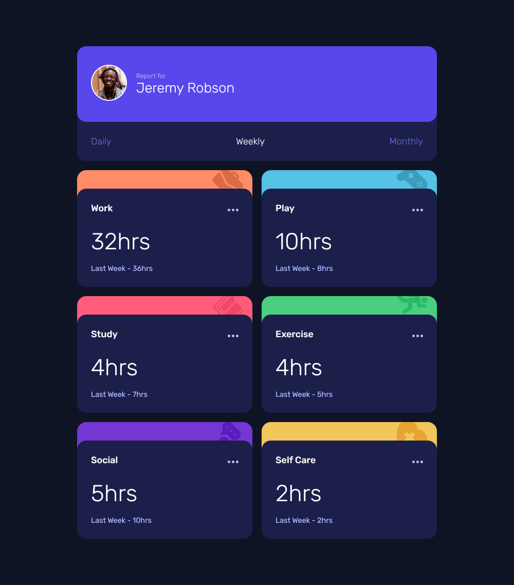
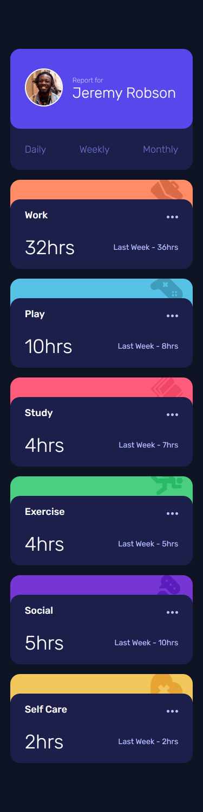

# Frontend Mentor - Time tracking dashboard solution

This is a solution to the [Time tracking dashboard challenge on Frontend Mentor](https://www.frontendmentor.io/challenges/time-tracking-dashboard-UIQ7167Jw). Frontend Mentor challenges help you improve your coding skills by building realistic projects.

## Table of contents

-   [Frontend Mentor - Time tracking dashboard solution](#frontend-mentor---time-tracking-dashboard-solution)
    -   [Table of contents](#table-of-contents)
    -   [Overview](#overview)
        -   [The challenge](#the-challenge)
        -   [Screenshot](#screenshot)
        -   [Links](#links)
    -   [My process](#my-process)
        -   [Built with](#built-with)
        -   [What I learned](#what-i-learned)
    -   [Author](#author)

## Overview

### The challenge

Users should be able to:

-   View the optimal layout for the site depending on their device's screen size
-   See hover states for all interactive elements on the page
-   Switch between viewing Daily, Weekly, and Monthly stats

### Screenshot

-   Desktop View
    

-   Tablet View
    

-   Mobile View
    

### Links

-   Solution URL: [Source Code](https://github.com/ChinatuL/Time-Tracking-Dashboard)
-   Live Site URL: [Live Site](https://chinatul.github.io/Time-Tracking-Dashboard/)

## My process

### Built with

-   Semantic HTML5 markup
-   CSS custom properties
-   Flexbox
-   CSS Grid
-   SCSS
-   Desktop-first workflow
-   JS Event Listeners
-   Javascript Object Notification (JSON)

### What I learned

In the course of building this project, I learned that the url for a json file in JavaScript has to be specified from the raw file content to enable github pages locate the file.

```js
const getDailyData = () => {
    fetch(
        "https://raw.githubusercontent.com/ChinatuL/Time-Tracking-Dashboard/main/json/data.json"
    );
};
```

## Author

-   Frontend Mentor - [@ChinatuL](https://www.frontendmentor.io/profile/ChinatuL)
-   Twitter - [@ChinatuLucia](https://www.twitter.com/chinatulucia)
